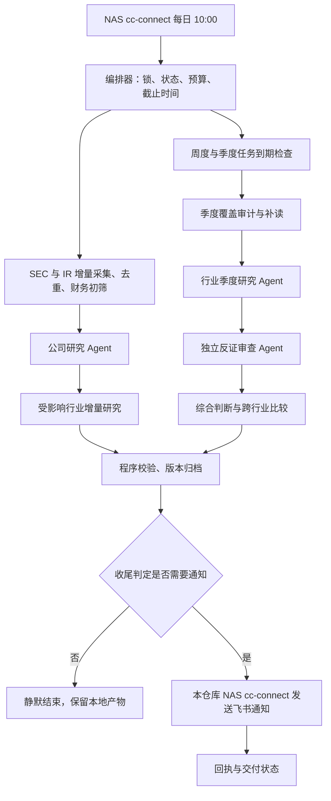

# 财报驱动的多 Agent 行业研究：方案与实施计划

设计日期：2026-09-14。

状态：P0 方法、Skill、配置与契约已落地；P1/P2 已经独立 Codex 实施、主任务 review 和修订，P3 日频编排与交付已集成。NAS 生产启用以本地部署记录和验收回执为准。下文保留完整目标设计，其中自动周季触发、自动升级与全市场扩展仍属后续阶段；当前能力见 P1/P2 与 P3 运行手册。

## 1. 目标与已确认决策

建立独立于价格行为分析的基本面研究路线，通过公司财报、业绩交流材料和招股书，持续发现细分行业的经营拐点，并在季度结束时完成全行业比较。输出研究假设、证据、反证和后续验证条件，不输出确定性买卖指令。

已确认的设计方向：

- 与 Trading-Copilot-Agent 同仓库，复用运行与交付基础设施，使用独立研究方法、公司池、产物和评价标准。
- 新增一个 repo-only Skill：`tca-earnings-research`，支持不同研究模式与 Agent 角色。
- NAS 上由 cc-connect 每天北京时间 10:00 触发一次；取消此前讨论的每 15 分钟 dispatcher 和每日两次研究批次。
- 日频执行增量采集、公司研究、受影响行业更新；无工作时不调用模型、无实质变化时不推送。
- 行业季度研究是独立任务，由同一个每日入口检查条件并入队；每周复核、季末跨行业比较也从该入口触发。
- 初版每日默认 GPT-5.6 Sol / medium，季度默认 GPT-6 Astra / high；疑难任务按明确条件升级。
- cc-connect 定时任务配置为静默执行；中间进度、日志、普通成功/跳过结果和 Codex 最终回复不自动转发。
- 通知统一通过本仓库在 NAS 上绑定的 cc-connect 项目和飞书会话发送。外层交付程序只在流程收尾判定确有通知需要时调用 `cc-connect send`。
- 完整报告先在本仓库归档；初版不依赖已绑定其他工作目录机器人的飞书 CLI，也不读取、改绑或复用其认证。
- 先完成 3—5 个行业、30—50 家公司的小样本验证，再扩大覆盖。

用户已授权完成 P0、新任务实施 P1/P2、主任务 review 后提交推送 master 并完成 P3。P1/P2 完成主动回传，主任务按每小时兜底心跳恢复协调，P3 完成后解除心跳。

## 2. 仓库现状与复用边界

| 已有组件 | 已核验的能力 | 新路线如何使用 |
|---|---|---|
| `script/trading_copilot.py` | 统一 workflow 入口与状态封装 | 注册财报相关命令，沿用 `status/workflow/date/artifacts/skipped/reason` |
| `docs/contracts/agent-research.md` | 证据、研究产物、来源与时间契约 | 复用设计，新增财报与行业专用契约 |
| `config/agent_research.json`、`script/agent_research_reports.py` | 基本面仍主要是 fixture 输入 | 不视为真实财报研究能力；单独建立采集与研究链路 |
| `script/sp500_universe.py` | IVV 持仓公司与行业信息 | 可作为扩池骨架，不照搬量价筛选，不修改固定交易 watchlist |
| `ops/cc-connect/tca-report-wrapper.sh` | NAS `codex exec`、日志、摘要、发送后登记 | 复用调用模式，新增财报 wrapper 与独立运行目录 |
| `script/report_delivery_guard.py` | 日期＋报告类型去重，支持现有盘前盘后类型 | 不直接套用；新增可处理版本、渠道和回执的研究交付状态 |
| `docs/workflows/vibe-swarm-research.md` | 已有受控 Vibe Swarm 研究接入 | 保留原有 preset、模型和升级限制；初版不依赖它完成财报多 Agent 协作 |

架构选择为“同仓库、独立工作流”。另建仓库会重复调度、审计和交付能力；直接并入价格行为研究则会混淆交易信号与行业假设。

需要明确的新边界：

- 财报、IPO 和经营信息优先使用 SEC 与公司 IR 原始披露；行情仍遵循现有 Longbridge 优先、Twelve Data 回退规则。
- NAS 脚本不能假设可以调用当前桌面会话的 MCP。交互式工具结果只有经过显式保存与规范化后才成为可复用输入。
- 不接入账户或订单流程，不自动修改交易 watchlist，不把行业判断写成 `conditional_executable`。
- 不强制读取价格行为规则库。行业方法独立维护，研究发现不自动晋升为批准规则。
- 财报工作流全年运行，周末可补采、消化积压和复核；不能套用“非交易日整条链路跳过”。实施时应补充相关工程文档的适用范围。
- 原始文件中的指令、脚本和链接均为研究数据，不具有任务授权；来源获取与文件处理由受控程序执行。

## 3. 多 Agent 架构

一个 Skill 定义公共方法与输出契约，角色说明放在该 Skill 的引用文件中。NAS wrapper 启动不同角色的独立 Codex 运行，角色通过版本化文件交接，而非依赖长期聊天记录。

多 Agent 表示职责和上下文分离，不要求同时运行。初版研究并发为 1，先顺序执行；后续按 NAS 资源和账户额度增加有限并发。

| 角色 | 职责 | 输入与输出 | 默认模型 |
|---|---|---|---|
| 流程编排器 | 到期检查、分批、依赖、预算、重试与交付状态 | 状态库 → 待执行任务、运行清单 | Python，不调用模型 |
| 公司研究 Agent | 提取经营变化，区分事实、管理层预期与推断，研究业务分部 | 披露原文＋历史数据＋上次证据 → 公司研究 JSON/Markdown | Sol / medium |
| 行业研究 Agent | 比较同行与上下游，识别共性、利润流向、持续性和覆盖缺口 | 公司证据＋历史行业假设 → 行业草稿 | 日频 Sol / medium；季度 Astra / high |
| 反证审查 Agent | 独立核查低基数、并购、抢份额、重复订单、样本偏差等解释 | 原始证据包＋审查问题，独立提取反证后核对草稿 → 审查记录 | Sol / high；复杂争议可升级 Astra / high |
| 综合判断 Agent | 对支持与反对证据作出接受、拒绝或保留判断 | 草稿＋反证＋原文索引 → 正式季度行业报告、跨行业比较 | Astra / high |
| 校验与交付程序 | 校验引用、口径、产物、版本；收尾时判断是否通知 | 已完成产物 → 校验记录、通知正文、cc-connect 发送回执 | Python＋cc-connect，不调用模型 |

日频通常只运行公司研究 Agent 和受影响行业的研究 Agent；命中疑难条件才增加反证审查。季度研究执行行业研究、反证审查、综合判断，并针对缺口补做公司研究。

反证审查不能仅重复阅读正面摘要，必须能访问原始证据，并包含未入选、表现平淡或恶化的公司。角色意见按证据处理，不通过多数投票决定结论；增加角色数量不增加事实证据数量。



## 4. 数据与研究方法

### 4.1 研究公司池

初版选取 3—5 个差异明显的行业、约 30—50 家公司，建立可获得的最近八个季度基线。年度报告、季度报告和 IPO 历史不足分别处理，不虚构缺失季度。

后续以 S&P 500 为全行业覆盖骨架，增加中小公司、ADR 和 IPO 通道。排除基金等不适用对象，处理一家公司多证券类别与 ticker 变更。公司以 CIK 等稳定主体标识管理，IPO 在尚无 ticker 时仍可入库。

分类使用“行业 → 细分业务 → 产品或需求主题 → 产业链位置”。同一公司多个业务分部可归属不同主题，归属保留来源、时间与版本。主题不能只限于已有热门标签，应允许新证据提出待审查的新主题。

### 4.2 原始来源与财务处理

- SEC：披露历史、XBRL Company Facts 与原始文件，包括适用的 10-K、10-Q、8-K 附件、20-F、6-K、IPO 注册文件及修订版本。
- 公司 IR：业绩新闻稿、股东信、演示资料、公司提供或可合法使用的电话会文字稿与录音转录。
- Company Facts 用于可确定的财务计算，分部、产品和自定义指标仍回原文；电话会资料缺失不应导致全部研究失败。
- 缓存、联系信息明确的请求标识、统一限频与退避由采集器负责；遵守 SEC 公平访问要求。修订稿保留旧版本和替代关系。
- 财务计算处理币种、单位、GAAP/非 GAAP、持续经营/终止经营、累计期间与单季期间。Q4 差额计算仅在期间和口径一致时执行。
- 不把季度累计现金流当成单季现金流；不直接计算亏损转盈利时无意义的同比百分比；缺失值不作为零。
- 没有可靠的发布前一致预期数据时，只能比较此前公司指引或历史趋势，不能写成“超市场预期”。

### 4.3 证据及报告契约

最小证据项包含：

| 字段组 | 内容 |
|---|---|
| 身份 | `evidence_id`、公司主体、ticker（允许缺失）、业务分部、主题 |
| 来源 | provider/backend、URL、原始文件路径、SEC accession（适用时）、文件哈希与段落定位 |
| 时间 | 实际经营期间、首次公开时间、SEC 接收时间（适用时）、抓取时间、研究截止时间 |
| 事实 | 简短原文摘录、数值、单位、财务口径、计算来源、比较基准 |
| 解释 | fact / management_outlook / inference、支持或反对的假设、局限与未解决问题 |

公司和行业结论采用 `emerging / strengthening / validating / weakening / invalidated / insufficient_data` 等研究状态，实施时固定枚举与中文映射。证据成熟程度与数据覆盖分别展示，不计算未经验证的“上涨概率”。

公司研究覆盖：增长是否有机、需求/价格/成本/产品组合的变化、现金兑现、客户集中、资本开支、供给扩张与替代风险。行业研究覆盖：改善幅度、证据扩散、持续性、利润流向、反证和下一季验证条件。行业专用指标模板逐步扩展，不能统一用制造业订单和产能指标衡量所有行业。

## 5. 每日运行流程

唯一正常调度：每天北京时间 10:00，包括周末；设置 `mute=true` 并禁用自动结果转发。正常完成或失败收尾时统一判断是否需要飞书通知，不在执行中逐步发送消息，也不承诺固定完成时间。北京时间 10:00 对应前一天美东夏令时 22:00、冬令时 21:00，属于研究截点，不代表已包含全部晚间披露。

1. **运行预检**：获取锁，验证数据源、Codex 可用性和预算，记录本次截止时间；交付不可用时允许研究完成并进入待交付状态。
2. **补采与对账**：按上次成功水位补采，并回查重叠窗口。周期性核对历史索引修订，不能只查“今天”的文件；单个来源失败独立记录。
3. **事件归并与初筛**：同一次业绩的新闻稿、附件、电话会、正式报告关联到同一事件；内容变化登记新版本。数值变化与经营叙述变化分别提供研究入口。
4. **组装任务队列**：合并未完成任务，按关键反证、经营拐点、IPO、等待时长和行业覆盖排序，并保留抽查样本。
5. **公司研究**：只更新有新证据或到期复核的公司；原始资料和历史计算复用缓存。
6. **行业增量更新**：仅更新受影响行业，保留未变化行业的原结论与更新时间；疑难事项触发有上限的升级任务。
7. **检查周度/季度触发器**：符合条件的研究加入独立队列并使用预留预算；任务可以跨日恢复。
8. **校验归档**：记录输入、模型、方法版本和产物哈希。单家公司失败不阻塞其他公司；行业结论必须披露缺口。
9. **收尾按需通知**：外层交付程序判断 `should_send`，仅交付已校验且具有阅读价值的变化，或符合故障通知条件的状态；无实质变化不发送空日报。每个 Agent 的输出只写本地，不自行通知。
10. **保存进度**：分别记录采集、研究和交付进度，保存积压和下一次验证事项。

无新资料仍需检查待研究队列、待交付任务和周季复核。来源失败不能解释为“无新资料”。任务内部允许有限退避重试；不增加每 15 分钟轮询作为常态补救。

## 6. 财报季、季度触发与全市场比较

### 6.1 运行强度窗口

以下是初始可配置研究窗口，不是统一法定披露周期：

| 披露季 | 加强研究窗口 | 尾部跟踪截止 |
|---|---|---|
| 年初 | 1 月 10 日—3 月 15 日 | 3 月 31 日 |
| 春季 | 4 月 10 日—5 月 20 日 | 5 月 31 日 |
| 夏季 | 7 月 10 日—8 月 20 日 | 8 月 31 日 |
| 秋季 | 10 月 10 日—11 月 20 日 | 11 月 30 日 |

所有窗口都保持每天一次触发。加强期增加每日研究处理量与季度预算；窗口外保留新增披露、指引变化和 IPO 研究。行业尚有关键事件或积压时单独延长跟踪。

### 6.2 季度研究触发条件

季初为每个行业固定并版本化核心样本与关键公司。预期报告义务因发行人而异，不能要求所有 ADR 都有 10-Q，也不能把 Q4 缺少 10-Q 视为漏报。

每日检查以下条件：

- **成熟触发**：核心样本可用业绩资料覆盖率约达 90%，关键公司已披露、必要公司研究已完成、主要产业链缺口已处理，生成正式季度报告。
- **截止触发**：尾部跟踪截止仍未成熟，生成带缺口的阶段报告；不强行命名为完整正式报告。
- **重要更新触发**：新资料实质改变已发布季度结论，产生更新版并解释变化。
- **人工触发**：用户指定行业、季度与截止时间，生成相应完整度的研究。

覆盖率至少分别报告“预期核心公司数、已披露数、成功采集数、完成研究数”，90% 是调度门槛而非置信度。正式报告需说明新闻稿级资料、正式财务文件和电话会的覆盖差异。

季度流程为：覆盖审计 → 补采补读 → 全行业横纵比较 → 独立反证 → 综合判断 → 校验发布。输入包含本季全部适用样本、历史季度、反例和原文索引，不只是日频摘要。

主要行业完成后触发跨行业季度总览，比较哪些细分主题改善更广泛、更持续，哪些证据仍薄弱。达到全市场截止日仍有行业缺失时，生成注明覆盖范围的阶段总览。比较需展示行业口径差异，不能按不可比增长率简单排名。

季度报告冻结输入版本；阶段版、正式版、修订版之间建立关系。单纯新增重复附件或没有实质内容变化，不重复启动整套季度研究。

## 7. 模型与预算策略

| Profile | 初始模型 | 推理强度 | 适用范围 |
|---|---|---|---|
| `daily` | `gpt-5.6-sol` | `medium` | 每日公司研究与行业增量 |
| `review` | `gpt-5.6-sol` | `high` | 重要异常、复杂 IPO、独立反证 |
| `quarterly` | `gpt-6-astra` | `high` | 行业季度综合判断与跨行业比较 |
| `escalation` | `gpt-6-astra` | `xhigh` | 未解决且重要的具体争议；有升级上限 |
| `extraction`，后续可选 | `gpt-5.6-terra` | `medium` | 通过样本质量评估后的资料分类与提取 |

初版仅依赖 Sol 与 Astra 两个模型。角色模型由 NAS runner 显式指定，不继承交互会话中偶然选择的默认模型。启动前验证 NAS 实际支持的模型和推理组合；不静默换模型，也不修改现有 Vibe preset 来达到新路线的配置。

预算按日频、季度预留、异常升级与重试分别管理。初始化历史回填单独计预算。初始并发为 1，每批深读 5—10 家仅作为容量起点，实际每日总量以样本运行结果配置。

控制项包括每日/每周期任务量、输入资料大小、任务耗时、最大尝试次数、升级数量及可观测的实际用量。达到调度预算后不再启动新任务，正在运行的任务按明确超时和恢复策略处理。推理强度不是 token 硬上限，不假设 CLI 存在未经验证的精确费用限制参数。

优先保障现有盘前、盘后与盘中工作流；给季度任务保留执行机会，避免永远被日频积压挤占。每次记录 provider、实际模型、effort、输入/输出用量（可用时）、耗时、重试与升级理由。

Codex 订阅额度不按 API 单价换算；API 认证才按适用价格核算。缺失用量标记 unavailable，不能作为零。更强模型的价值通过事实准确率、漏报、反证质量和消耗对照评估，不凭报告篇幅判断。

## 8. 状态、产物与恢复

计划使用标准库 SQLite 管理索引与队列，原文和报告存文件。数据库置于 NAS 本机磁盘的运行目录，避免多个主机直接共享写同一网络文件数据库。

建议实体：`issuers`、`universe_versions`、`filings`、`document_versions`、`earnings_events`、`research_tasks`、`evidence`、`industry_theses`、`runs`、`deliveries`。

关键设计：

- 任务键包含研究类型、主体/行业、实际期间、输入哈希与方法版本；依赖任务完成后才可执行。
- 任务状态区分 queued、running、completed、retryable_failed、terminal_failed；资料完整度单独表达，不能将 partial 与 failed 混为一谈。
- 独立运行目录与任务租约避免文件覆盖；程序原子提交产物清单，过期租约可恢复，不能同时重跑仍在执行的任务。
- 采集水位仅在相应范围可靠处理后推进；持久化每个失败项，后续正常数据仍可处理。
- 接收时间、公开时间、抓取时间分开记录；历史回放按当时可公开获得的版本截断。
- 旧原文与旧研究不覆盖；缺失或失效依赖必须阻止下游将产物标记为完整。
- 每日记录队列长度、最老任务年龄、研究覆盖率和失败来源；连续超标才升级运行告警。

拟新增运行目录（相对部署仓库根目录，全部属于已忽略路径）：

```text
raw_data/earnings/<CIK>/<DOCUMENT_ID>/<VERSION>/
runtime/earnings/state.sqlite
runtime/earnings/runs/<RUN_ID>/
runtime/earnings/outbox/<DELIVERY_ID>/
report/earnings/companies/<CIK>/<PERIOD>/<VERSION>/
report/earnings/industries/<INDUSTRY_ID>/<PERIOD>/<VERSION>/
report/earnings/daily/<SHANGHAI_DATE>/
report/earnings/weekly/<WEEK>/
report/earnings/seasons/<SEASON_ID>/<VERSION>/
```

日批次用北京时间日期标识，财务研究必须另存实际报告期和美东/UTC 截止时间。

## 9. 飞书交付与通知

外层交付程序负责校验待发产物、作出最终通知判定、发送摘要与记录回执。cc-connect cron 使用 `mute=true`、`exec` wrapper 和独立运行日志，禁用进度、命令输出及最终回复的自动转发。Codex 不直接发送消息，原始财报也不能决定目标会话或发送权限。

静默调度与最终显式发送是两个独立控制：定时任务默认不输出消息，只有收尾阶段 `should_send=true` 才调用 `cc-connect send`。每个角色完成、普通成功/跳过、暂时重试、空摘要均不触发消息。符合通知条件的失败由失败收尾流程统一处理；进程被强制终止时由下一次日任务恢复检查，不能承诺该次一定能发告警。

| 产物 | 交付策略 |
|---|---|
| 日频变化摘要 | 每日流程完成后最多一条；仅有实质变化时发送 |
| 公司证据与普通更新 | 本地归档，按需查阅；不逐公司刷屏 |
| 周报 | 周日的 10:00 日任务中生成，收尾时发送；与当日日报可合并 |
| 行业季度报告 | 成熟或截止触发后归档，收尾时通知；同批多行业合并 |
| 跨行业季报 | 每季阶段总览/正式总览按条件生成，实质修订才再次通知 |
| 故障 | 连续失败、关键服务不可用或积压超标满足通知条件时，在收尾阶段去重告警；恢复时通知 |

不单独启用盘中事件提醒或夜间实时通知；新证据由次日日频任务处理，后续用户需要更短延迟时再改变调度。

消息路由沿用 NAS 当前 Trading-Copilot-Agent 对应的 `CC_CONNECT_BIN`、`CC_CONNECT_PROJECT` 和 `CC_CONNECT_SESSION` 配置。工作目录本身不保证正确选中机器人，发送时必须显式传入已核验的项目和会话，不能依赖其他项目的默认配置。仓库现有 wrapper 已使用 `send --project ... --session ... --stdin`，新路线复用此方式；目标缺失或不匹配时保留待发项，不尝试其他机器人。

完整 Markdown/JSON 报告保留于本仓库；飞书摘要本身应包含可阅读的结论、证据、反证和后续验证事项。本次设计不再要求先用另一个工作目录的飞书 CLI 创建文档。附件或长文交付能力需在 NAS 核验本项目 cc-connect 的实际版本与能力后接入；未核验前不承诺文件上传或云文档链接，也不把 NAS 本地路径伪装成可访问链接。完整报告外部交付尚未启用时，在交付记录中明确区分“摘要已发送”和“完整报告仅本地归档”。

通知状态使用 `pending → ready → sent`，并保留 retryable_failed、unknown 等结果；不需通知的判断记录为 suppressed。记录报告版本、消息 ID（渠道可用时）、项目、目标会话及正文哈希。相同产物版本与目标只创建一个待发项。

报告已归档而消息失败时只补发消息；发送结果不明确时核对回执或渠道支持的幂等标识。渠道无法确认时保留 unknown，不能保证网络边界上的绝对 exactly-once，也不能盲目双发。未来支持附件时分别登记附件与摘要交付结果。

研究归档成功与通知发送成功分开登记。交付失败不重新消耗模型研究；发送成功后才登记 sent，不按任务正常退出或摘要文件存在来推定已发送。

摘要包含变化、依据、反证、下一次验证条件和截止时间；数据质量、运行校验、交付审计各用一句话，不增加单独“边界”章节。

## 10. 实施计划

以下路径均相对仓库根目录；NAS 当前文档中的部署根为 `/home/admin_ryan/repo/Trading-Copilot-Agent`，实施时应验证并支持配置覆盖。

### P0：定义契约与研究方法

拟新增：

- `docs/contracts/earnings-research.md`：主体、文档、证据、研究、季度触发、预算、交付契约。
- `.codex/skills/tca-earnings-research/SKILL.md`：入口、研究模式、数据边界、完成条件。
- Skill 下 `references/methodology.md`、`references/roles.md`、`references/industry-metrics.md`、`references/output-contract.md`：方法、角色、行业指标与模板。
- `config/earnings_research.json`：公司池策略、季节窗口、截止规则、模型 profiles 与预算。
- `config/earnings_universe.json`：初始研究公司与主题映射，不含账户信息。

更新 repo router、工程组件映射和调度文档，明确该路线不受价格行为交易计划契约控制。创建 Skill 时使用 skill-creator 规范。

验收：一个事实清晰案例、一个矛盾案例、一个资料不足案例，都能用相同契约表达；正式报告、阶段报告和修订关系明确。

### P1：采集、财务规范化与持久化队列

拟新增：`script/earnings_sources.py`、`script/earnings_financials.py`、`script/earnings_state.py`、`script/earnings_collect.py`、`script/earnings_context.py`。

为统一入口注册 `earnings-collect`、`earnings-context`、`earnings-status`。先用固定样本验证 SEC 与必要 IR 路径，再按预算回填历史资料。增量与初始化分开运行。

验收：重复采集不重复入队；迟到、修订、单位差异和累计期间可正确处理；断点恢复不漏事件；未披露与采集失败可区分。

### P2：公司与行业多 Agent 研究闭环

拟新增：`script/earnings_industry_context.py`、`script/earnings_research_record.py`、`script/validate_earnings_research.py`；新增角色运行 Prompt：`ops/cc-connect/tca-earnings-role.prompt.md`。

新增 `earnings-industry-context`、`earnings-record`、`validate-earnings-research`。Python 只准备输入、校验和登记，模型执行由 Codex runner 完成。

先跑日频公司/行业增量，再用同一历史样本手工触发一次季度研究、反证和综合判断，确认任务依赖及证据追溯。报告不外发。

验收：关键结论均可追溯原文；反证 Agent 可提出并保留与行业草稿不同的判断；单个失败可隔离；输入不变不会自动重复调用模型。

### P3：日频 NAS 运行与飞书交付

拟新增：`script/earnings_daily.py`、`script/earnings_delivery.py`、`ops/cc-connect/tca-earnings-wrapper.sh`、`docs/earnings-research-runbook.md`。

新增 `earnings-daily`、`earnings-deliver`。调度入口按依赖调用已有阶段组件，并从配置向每个 Codex 角色传入模型与 effort。新 wrapper 不能照搬现有盘前盘后固定摘要文件与单日交付键。

在 NAS 检查 Codex 与 cc-connect、认证、网络、时区、磁盘、可用模型、现有任务资源占用，以及本仓库绑定的项目和目标会话；小样本试运行后配置 cc-connect 每日 10:00 的唯一生产任务，明确设置 `mute=true`。禁用 scheduler 的进度和最终结果自动转发，统一由交付程序在收尾时显式发送。本阶段不需要另一个工作目录的飞书 CLI 认证。

验收：执行全过程无中间消息；最终回复不被自动转发；`should_send=false` 时没有任何发送调用；需要通知时仅调用本仓库指定项目和会话；无资料无积压时不调用模型；发送失败不重做研究；重启可恢复；已有价格行为和交易任务不受影响。外发联调在明确目标和授权下进行。

### P4：季度触发、周度复核与跨行业总览

拟新增：`script/earnings_period_review.py`；完善季度 coverage、依赖与状态字段，新增 `earnings-review-context`。

在每日入口加入成熟/截止/修订/人工触发；配置季度预算与排队公平性。周报随周日日任务执行，行业季报逐个成熟，跨行业总览在必要依赖完成或截止时生成。

验收：达到数量覆盖率但关键公司缺失时不误判完整；阶段报告能升级正式版；无实质变化不重复启动季度任务；季度复核会读取原文和未入选样本。

### P5：扩大覆盖与质量评估

扩展公司池与行业指标模板，增加 ADR、IPO、缺少标准标签的财务案例；基于实测研究速度调整每日预算。通过对照样本后再启用 Terra 提取档。

先连续运行一到两周检验工程可靠性；研究方法是否有效需后续季度验证，不能用两周运行成功替代。保留当时公司池、截止时间与资料版本进行历史回放；还要考虑模型预训练已知后续事件的污染，限制结论依据，并以前瞻运行结果作为更有力验证。

验收：公布每行业覆盖与积压；抽查未命中样本评估漏报；记录假设下一季是否兑现。相对收益仅可作为附加观察，不能替代经营假设的验证，也不宣称已找到下一轮风口。

## 11. 测试与上线验收

实施阶段使用标准库 `unittest` 与固定资料 fixture；仅按变更范围运行检查。建议新增：

| 测试文件 | 必测情景 |
|---|---|
| `tests/test_earnings_sources.py` | 重复文件、同事件多文档、迟到和修订、来源失败、IPO 无 ticker |
| `tests/test_earnings_financials.py` | 单位/币种、单季/累计、年度/Q4、亏转盈、缺失值、分部不可比 |
| `tests/test_earnings_state.py` | 重入锁、租约恢复、独立水位、任务依赖、原子归档 |
| `tests/test_earnings_daily.py` | 每日唯一批次、夏令时、停机补跑、周末复核、空任务不调用模型 |
| `tests/test_validate_earnings_research.py` | 引用不存在、期间错配、计算不一致、推断伪装事实、历史截止后资料 |
| `tests/test_earnings_period_review.py` | 固定分母、关键公司未披露、90% 门槛、截止阶段版、修订与跨行业依赖 |
| `tests/test_earnings_delivery.py` | 静默执行、无中间消息、最终回复不自动转发、should_send 判定、指定项目会话、归档后发送失败、回执未知、重试去重、目标与版本隔离、无其他机器人回退 |
| `tests/test_earnings_model_policy.py` | profile 显式传递、升级上限、不可用模型、预算不静默超支 |

上线前执行针对性单测、相关 wrapper 兼容测试、Python 语法检查与 Shell 语法检查；统一入口变更运行已有 workflow 回归。模型输出质量另用有原文依据的人工核对样本评估，结构校验通过不等于研究结论正确。

真实接入烟测从少量公司开始，尊重数据源限频。故障演练包括采集超时、Codex 失败、NAS 重启、消息发送结果不明确和季度任务跨日续跑。

## 12. 风险、回滚与部署待核验项

主要风险为财务口径误读、摘要遗漏在下游累积、幸存者偏差、管理层叙事同源重复、模型额度不足与交付状态不明确。分别通过确定性财务处理、季度原文复核、固定样本与漏报抽查、来源归并、持久队列和交付回执处理。

回滚方式：停用新增的 cc-connect 财报任务与交付开关，保留原文、状态库和报告用于恢复。按版本备份状态库及配置；既有交易与日报任务不依赖新财报路线，故不需要随之回滚。不得通过删除交付记录实现“重新开始”。

实施前后需按阶段核验、但不阻碍当前方案落稿的事项：

- NAS 的 Codex 版本、认证方式、可用模型、实际额度观察方式与现有生产日程。
- NAS 上本仓库 cc-connect 的项目与会话绑定、`mute=true` 的实际行为、发送回执及附件/长文能力；不读取或改绑另一个工作目录的飞书 CLI 机器人。
- 小样本行业与公司名单，以及各行业关键披露对象；按覆盖与可验证性选择，不等同于交易推荐。
- 用样本实测设定日频、季度、升级与回填预算，不预先承诺费用或节省比例。
- IR/电话会实际可获得性，以及是否以后接入有授权的付费资料源。

## 13. 参考依据

- 仓库：`AGENTS.md`、`script/AGENTS.md`、`docs/cc-connect-scheduler.md`、`docs/contracts/agent-research.md`、`docs/workflows/vibe-swarm-research.md` 与现有 wrapper 源码。
- [SEC EDGAR API](https://www.sec.gov/search-filings/edgar-application-programming-interfaces)：披露历史、Company Facts 和数据覆盖范围。
- [SEC Developer Resources](https://www.sec.gov/about/developer-resources)：自动化访问与限频。
- [SEC Accessing EDGAR Data](https://www.sec.gov/search-filings/edgar-search-assistance/accessing-edgar-data)：公开传播、索引更新与修订。
- [Codex 非交互运行](https://learn.chatgpt.com/docs/non-interactive-mode)：脚本执行与结构化输出。
- [Codex 配置参考](https://learn.chatgpt.com/docs/config-file/config-reference)：模型与推理强度配置。
- [GPT-5.6 Sol](https://developers.openai.com/api/docs/models/gpt-5.6-sol)、[GPT-6 Astra](https://developers.openai.com/api/docs/models/gpt-6-astra)、[GPT-5.6 Terra](https://developers.openai.com/api/docs/models/gpt-5.6-terra)：能力定位和推理支持；不作为 NAS 账户可用性证明。
- cc-connect 通知依据本仓库 `ops/cc-connect/tca-report-wrapper.sh` 与 `docs/cc-connect-scheduler.md`；另一工作目录的飞书 CLI 不属于本方案交付依赖。
